## **Task2: list_resources_regionwise**

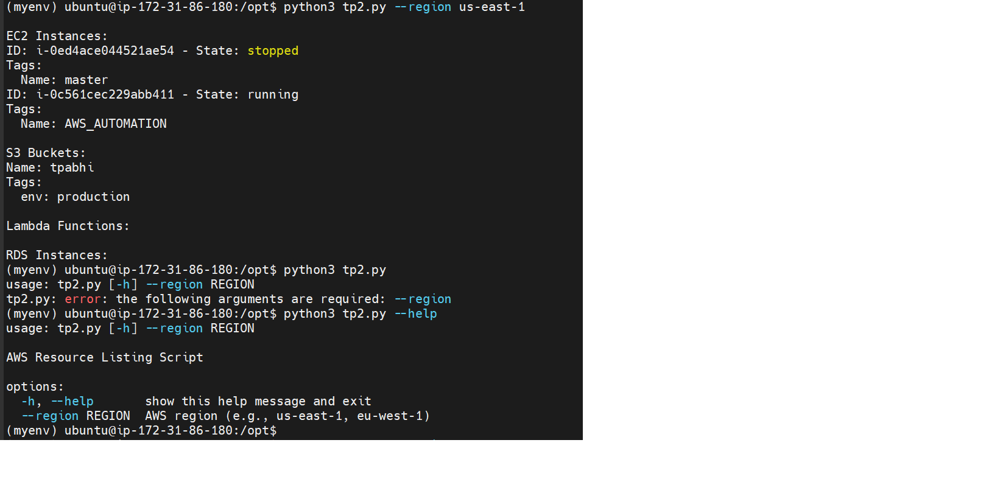

## **Task3: Manage Instances**

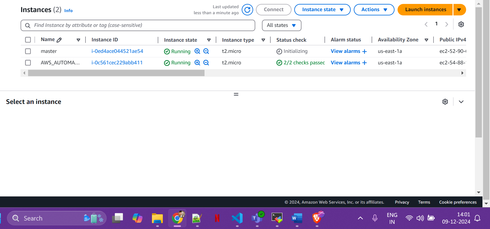
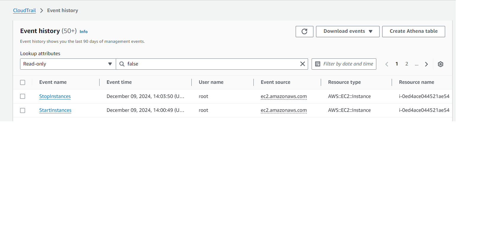

## **Task4: Create Instances**

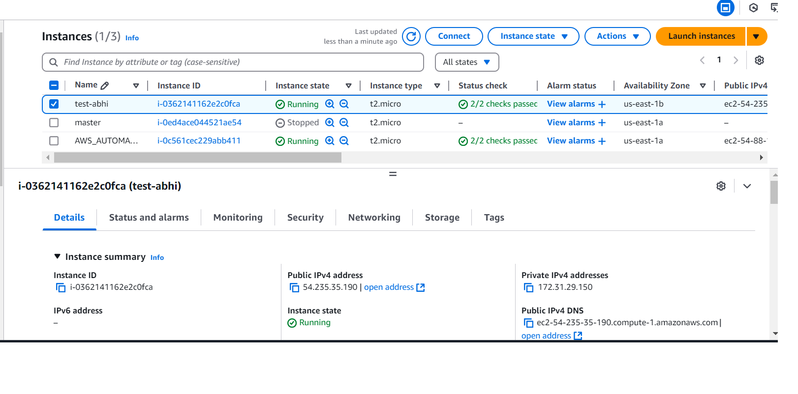
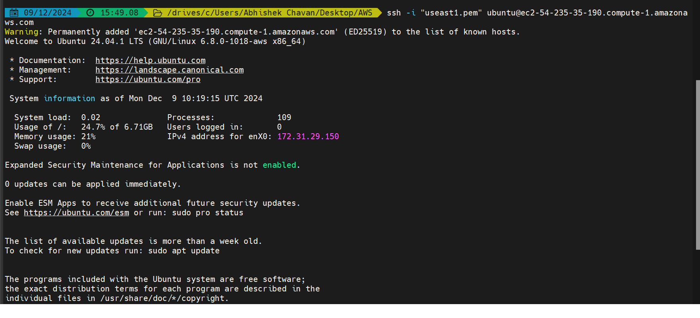

## **Task5: Create S3 bucket**

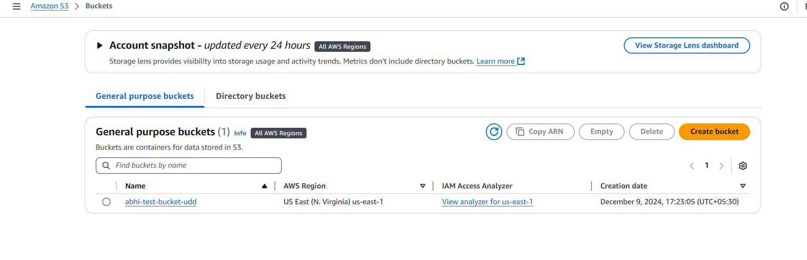

## **Task6: 6.create_sns_topic_and_subcription**

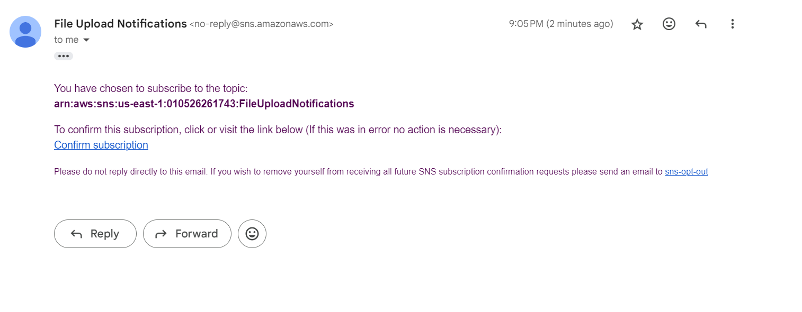
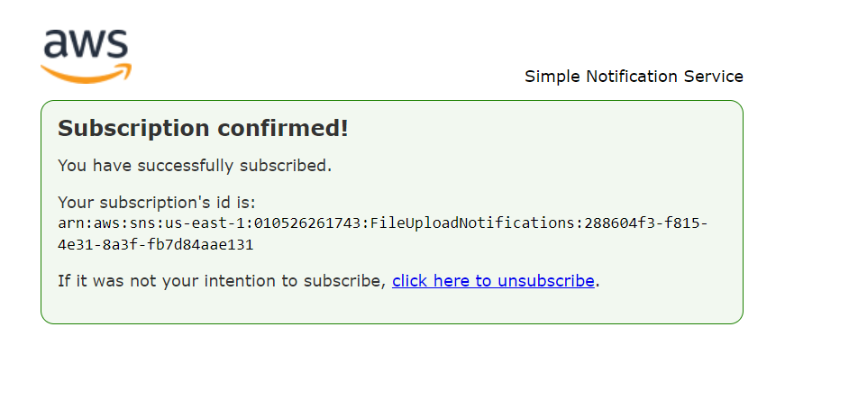
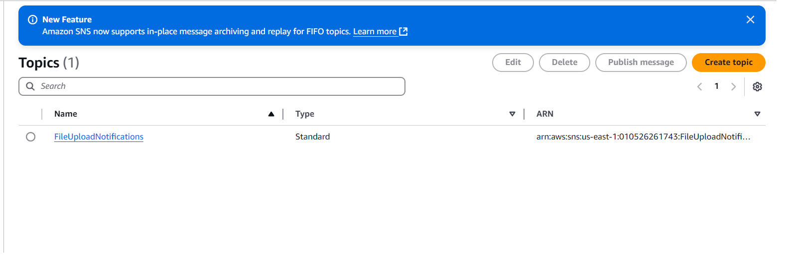
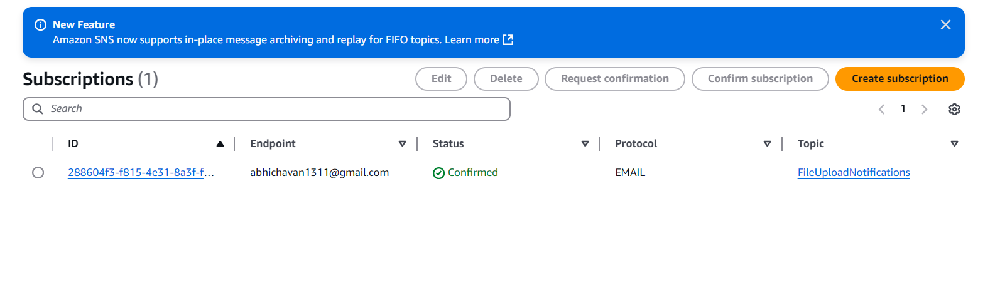

## **Task7: 7.Importing_one_python_module_into_another**

Example Output for task7: main_script2.py

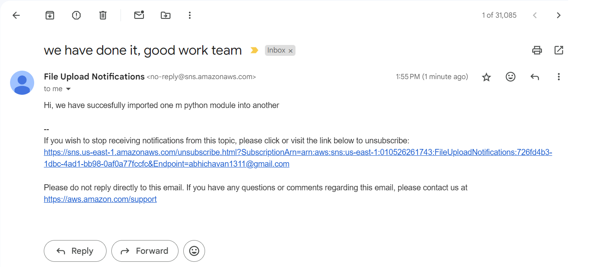

## **Task8: 8_create_IAM_role

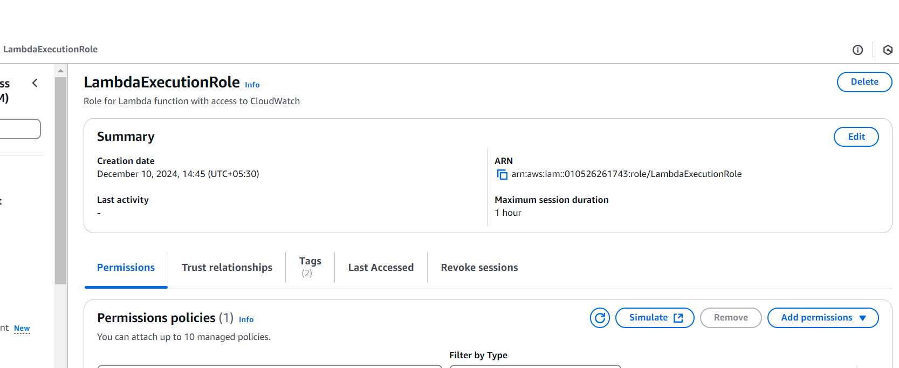

## **Task9: 9_execute_file_from_github_repo_directly**

Purpose of using "sudo -E python3 Execute_script_from_github_url.py" !!

Ans:
Without sudo: When you run the script as a normal user (python3 Execute_script_from_github_url.py), it uses the environment and credentials of your current user. So if your AWS credentials are set up for that user (e.g., through aws configure), the script will be able to access them.

With sudo: When you run a command with sudo, it executes the command as the root user by default. This means that the root user’s environment variables (including AWS credentials) are used, and the environment variables of your current user (like the AWS credentials) might not be available unless explicitly passed.

Without -E (i.e., sudo python3 Execute_script_from_github_url.py): The environment variables from your current user are not passed to the root environment. As a result, the AWS credentials that are set for your user won’t be available when the script is executed as root, causing an error like "Unable to locate credentials."

With -E (i.e., sudo -E python3 Execute_script_from_github_url.py): The -E flag tells sudo to preserve the environment of the user who invoked the command (including environment variables like AWS credentials). This ensures that the script can access your AWS credentials even though it's being run with sudo and as the root user.

## **Task10: 10_Download_and_Execute_script_Dynamically**

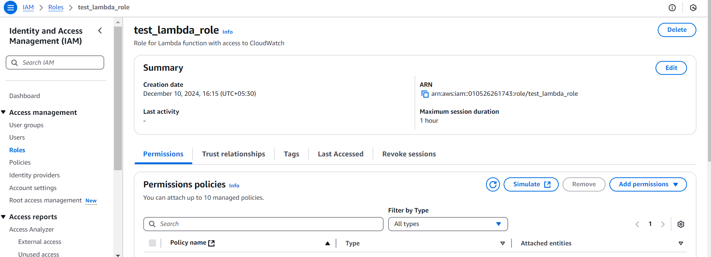

⚠️ Warning: Using exec can be risky as it directly runs the fetched code, which could include malicious instructions. Use only trusted URLs.

