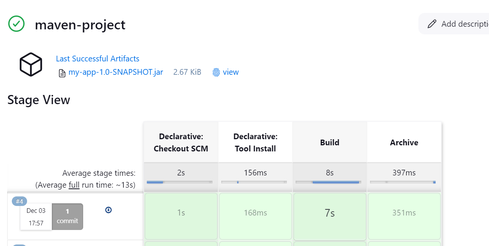

---

# Jenkins Tasks for ExpleoGroup

Welcome to the **ExpleoGroup Jenkins Task Documentation**! This document provides a comprehensive guide to understanding, setting up, and executing Jenkins tasks tailored to the needs of ExpleoGroup. Whether you're a beginner or an experienced Jenkins user, this guide ensures a seamless experience.

---

## Table of Contents

1. [Introduction](#introduction)  
2. [Setup and Prerequisites](#setup-and-prerequisites)  
3. [Task Overview](#task-overview)  
   - [Initial Creation and Installation of the Jenkins Jobs](#initial-creation-and-installation-of-the-jenkins-jobs)  
   - [Simple Build Using Maven Application](#simple-build-using-maven-application)  
   - [Publish Test Case Reports on Jenkins UI Graph](#publish-test-case-reports-on-jenkins-ui-graph)  
   - [Archive the Artifacts in CI/CD Using Post Build Action](#archive-the-artifacts-in-ci-cd-using-post-build-action)  
   - [Trigger Email if There Is an Unstable Build](#trigger-email-if-there-is-an-unstable-build)  
   - [Authenticate as Valid Jenkins User to GitHub Repository, Create Job and Build It](#authenticate-as-valid-jenkins-user-to-github-repository-create-job-and-build-it)  
   - [Change Jenkins IP If the Instance Is Restarted](#change-jenkins-ip-if-the-instance-is-restarted)  
   - [Trigger Job Using Webhook, Poll SCM, or Build Periodically](#trigger-job-using-webhook-poll-scm-or-build-periodically)  
   - [Master-Slave Configuration](#master-slave-configuration)  
   - [Using GitHub with IDE (VSCode)](#using-github-with-ide-vscode)  
   - [Create Pipeline Script from SCM with Different Scenarios](#create-pipeline-script-from-scm-with-different-scenarios)

4. [Task Execution Steps](#task-execution-steps)  
5. [Best Practices](#best-practices)  
6. [Troubleshooting](#troubleshooting)  
7. [Additional Points](#Additional-Points)

---

## Introduction

Jenkins is a powerful automation server used to build, deploy, and automate various aspects of the software development lifecycle. This documentation will walk you through specific Jenkins tasks designed for ExpleoGroup's workflow, highlighting their importance and detailing how to implement them effectively.  

> **Why Jenkins?**  
> Jenkins provides continuous integration (CI) and continuous delivery (CD) capabilities that ensure seamless and automated workflows.

---

## Setup and Prerequisites  

To begin, ensure the following prerequisites are met:  

### **1. Prerequisites** 
**Minimum hardware requirements:**
256 MB of RAM

1 GB of drive space (although 10 GB is a recommended minimum if running Jenkins as a Docker container)

**Recommended hardware configuration for a small team:**
4 GB+ of RAM,
50 GB+ of drive space

### **2. Jenkins Installation**  
- Download and install Jenkins from the [official Jenkins website](https://www.jenkins.io/).  
- Ensure Java is installed on your system [java requirement](https://www.jenkins.io/doc/book/platform-information/support-policy-java/) 
- setup JAVA_HOME
 

### **3. Plugins Required**  
Install the following plugins:  
- **Git Plugin**: For managing code repositories. (bydefault will be there in most of the versions) 
- **Pipeline Plugin**: To create Jenkins pipelines.(bydefault will be there in most of the versions) 
- **Blue Ocean**: For an improved UI experience.  
- **Stage View**: visual representation of the stages in a pipeline, allowing users to track the progress and status of each stage during execution.
- **Email Extension Plugin**: For SMTP server configuration
- **Maven IntegrationVersion**: provides a deep integration between Jenkins and Maven.

### **4. Jenkins installation using linux**

ubuntu@ip-172-31-26-103:~$ history

sudo apt-get update

sudo apt-get install openjdk-21-jdk -y

java --version

which java

sudo update-alternatives --config java

sudo wget -O /usr/share/keyrings/jenkins-keyring.asc https://pkg.jenkins.io/debian-stable/jenkins.io-2023.key

echo "deb [signed-by=/usr/share/keyrings/jenkins-keyring.asc] https://pkg.jenkins.io/debian-stable binary/" | sudo tee /etc/apt/sources.list.d/jenkins.list > /dev/null

sudo apt-get update

sudo apt-get install jenkins

jenkins --version

sudo vi /etc/default/jenkins (add JAVA_HOME in this file)

sudo systemctl restart jenkins

sudo systemctl status jenkins

Now hit, IP-Address:8080 on web browser

**Why Set JAVA_HOME for Jenkins?
Explicit Java Version Control:**

Jenkins depends on Java, and specifying JAVA_HOME ensures that Jenkins uses the correct version of Java installed on your system. This is particularly important when multiple versions of Java are installed.

1. Prevent Startup Errors:

    If JAVA_HOME is not set, Jenkins might fail to start or use an incorrect Java version, which could lead to runtime errors or incompatibility issues.
2. Consistency Across Users and Processes:

    Setting JAVA_HOME ensures that any Jenkins jobs, plugins, or scripts that rely on Java use the same environment configuration.
3. Custom Java Options:

    Some advanced Jenkins configurations or plugins require additional Java options. By setting JAVA_HOME, you can more easily configure JAVA_OPTS or JENKINS_JAVA_OPTIONS.

**How to Set JAVA_HOME for Jenkins**
1. Verify Java Installation
Ensure Java is installed and locate its installation directory:

    sudo update-alternatives --config java

    (Copy the Java installation path, e.g., /usr/lib/jvm/java-21-openjdk-amd64.)

2.Set JAVA_HOME in a way that Jenkins can use it:
    
     sudo vi /etc/default/jenkins
and set 
     JAVA_HOME="/usr/lib/jvm/java-21-openjdk-amd64"

     sudo systemctl restart jenkins

---

## Task Overview  

For the tasks details kindly refer jenkins task.docx file given in the github repo itself.

Note: Due to github restrictions you might have to use raw format which you can download by clicking on it.

## Best Practices

yet to be added

## Troubleshooting

yet to be added

## Additional Points

1. Do we need maven installed on slave ?
Ans: Maven Installed on Master (Available to Slave): If you’ve configured the Maven installation on the Jenkins master and the jobs are configured to use that installation, Jenkins can invoke Maven remotely on the slave without requiring Maven to be installed on the slave itself.

Let's take below example:

Pipeline_job :

pipeline {
    agent {
        label 'slave1'
    }

    parameters {
         string defaultValue: 'chavan', name: 'LASTNAME'
    }

    environment {
         NAME = "Abhishek"
    }

    tools {
         maven 'maven1'
    }
    
    stages {
        stage('Build') {
            steps {
                sh 'mvn clean package -DskipTests'
                sh 'ls -l target/' 
                echo "hi $Name ${params.LASTNAME}"
            }
        }
        stage('Archive') {
            steps {
                echo "Archiving artifacts"
                archiveArtifacts artifacts: '**/target/*.jar', fingerprint: true
            }
        }
    }
}

As you can see in below image maven is not installed on my slave1

but my job ran successfully on it,checkout below logs

**2. Jenkins defaults**

JENKINS_HOME: 
ubuntu@ip-172-31-23-191:/var/lib/jenkins$ ls -lt 

Important Files and Directories

config.xml -
Use: Stores Jenkins' global configuration, such as security settings, system settings, and tool configurations.
Do not delete: Essential for Jenkins operation.

jobs/ - 
Use: Contains subdirectories for each job. Inside each job, you’ll find configurations (config.xml), build history, and other metadata.
Important: This directory stores all job data and history.

/var/lib/jenkins/jobs contents:

ubuntu@ip-172-31-23-191:/var/lib/jenkins$ cd jobs/

ubuntu@ip-172-31-23-191:/var/lib/jenkins/jobs$ ls

final-maven-project  maven-project  pipeline_job  slave-job  tp

ubuntu@ip-172-31-23-191:/var/lib/jenkins/jobs$ cd maven-project/

ubuntu@ip-172-31-23-191:/var/lib/jenkins/jobs/maven-project$ ls -lt

total 12

drwxr-xr-x 6 jenkins jenkins 4096 Dec  3 12:27 builds

-rw-r--r-- 1 jenkins jenkins 2075 Dec  3 12:27 config.xml

-rw-r--r-- 1 jenkins jenkins    2 Dec  3 12:27 nextBuildNumber

ubuntu@ip-172-31-23-191:/var/lib/jenkins/jobs/maven-project$ cd builds/

ubuntu@ip-172-31-23-191:/var/lib/jenkins/jobs/maven-project/builds$ ls -lt

total 20

drwxr-xr-x 4 jenkins jenkins 4096 Dec  3 12:27 4

-rw-r--r-- 1 jenkins jenkins  124 Dec  3 12:27 permalinks

drwxr-xr-x 4 jenkins jenkins 4096 Dec  3 11:57 3

drwxr-xr-x 3 jenkins jenkins 4096 Dec  3 11:55 2

drwxr-xr-x 3 jenkins jenkins 4096 Dec  3 11:51 1

-rw-r--r-- 1 jenkins jenkins    0 Dec  3 11:50 legacyIds

ubuntu@ip-172-31-23-191:/var/lib/jenkins/jobs/maven-project/builds$ cd 4

ubuntu@ip-172-31-23-191:/var/lib/jenkins/jobs/maven-project/builds/4$ ls -lt

total 60

-rw-r--r-- 1 jenkins jenkins 17748 Dec  3 12:27 build.xml

-rw-r--r-- 1 jenkins jenkins 21037 Dec  3 12:27 log

drwxr-xr-x 2 jenkins jenkins  4096 Dec  3 12:27 workflow-completed

-rw-r--r-- 1 jenkins jenkins    99 Dec  3 12:27 log-index

drwxr-xr-x 3 jenkins jenkins  4096 Dec  3 12:27 archive

-rw-r--r-- 1 jenkins jenkins   478 Dec  3 12:27 changelog2445842313786596415.xml

**Important: Where does jenkins stores the artifacts:**

ubuntu@ip-172-31-23-191:/var/lib/jenkins/jobs/maven-project/builds/4/archive/target$ ls -lt

total 4

-rw-rw-r-- 1 jenkins jenkins 2730 Dec  3 12:27 my-app-1.0-SNAPSHOT.jar

workspace/ -
Use: Stores temporary files and build artifacts for each job's workspace during the build process.
Safe to clean periodically: Only delete unused job workspaces to free space, as Jenkins can recreate them.

plugins/ -
Use: Stores all Jenkins plugin .jpi or .hpi files.
Do not delete: Needed for plugin functionality. Deleting plugins may cause Jenkins to break.

credentials.xml -
Use: Stores encrypted credentials (e.g., usernames, passwords, tokens).
Do not edit/delete manually: Modifications here may corrupt credentials.

users/- 
Use: Stores user account information and settings for Jenkins users.
Do not delete: Required for user authentication and permissions.

logs/ -
Use: Contains Jenkins system and build logs.
Safe to clean periodically: Clear old logs to save space, as new logs will be generated.

WorkSpace:

ubuntu@ip-172-31-23-191:/var/lib/jenkins/workspace$ ls -lt

total 40

drwxr-xr-x 6 jenkins jenkins 4096 Dec  4 05:51 final-maven-project

drwxr-xr-x 6 jenkins jenkins 4096 Dec  3 13:02 java-maven-sample-war-project

drwxr-xr-x 6 jenkins jenkins 4096 Dec  3 11:55 maven-project\

**what does project include?**

ubuntu@ip-172-31-23-191:/var/lib/jenkins/workspace/maven-project$ ls -lt

total 20

-rw-r--r-- 1 jenkins jenkins 1078 Dec  3 11:55 LICENSE.txt

-rw-r--r-- 1 jenkins jenkins  752 Dec  3 11:55 README.md

drwxr-xr-x 3 jenkins jenkins 4096 Dec  3 11:55 jenkins

-rw-r--r-- 1 jenkins jenkins 2387 Dec  3 11:55 pom.xml

drwxr-xr-x 4 jenkins jenkins 4096 Dec  3 11:55 src

ubuntu@ip-172-31-23-191:/var/lib/jenkins/workspace/maven-project$

ubuntu@ip-172-31-23-191:/var/lib/jenkins/workspace/maven-project$ cd jenkins/

ubuntu@ip-172-31-23-191:/var/lib/jenkins/workspace/maven-project/jenkins$ ls -lt

total 8

-rw-r--r-- 1 jenkins jenkins  414 Dec  3 11:55 Jenkinsfile

drwxr-xr-x 2 jenkins jenkins 4096 Dec  3 11:55 scripts

**Importance of /etc/defaults/jenkins file:**
- Startup Configuration: It contains options that the jenkins service reads during startup, such as Java options, ports, and paths.
- Environment Variables: Sets environment variables that the Jenkins process can use.
- Customizations: Allows administrators to modify Jenkins settings without editing the main service file (e.g., /lib/systemd/system/jenkins.service).

- Common Parameters in /etc/default/jenkins

- Jenkins Port: Configures the port Jenkins will use for its web interface.

        HTTP_PORT=8080
- Jenkins Home Directory: Sets the location of the Jenkins home directory.

        JENKINS_HOME=/var/lib/jenkins
- Setup JAVA_HOME to avoid any java related confusions, specifically if you have multiple java installed.
